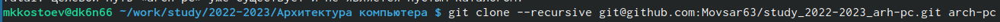

---
## Front matter
title: "Лабораторная работа №2"
subtitle: "Архитектура компьютера"
author: "Мовсар казбекович Костоев"

## Generic otions
lang: ru-RU
toc-title: "Содержание"

## Bibliography
bibliography: bib/cite.bib
csl: pandoc/csl/gost-r-7-0-5-2008-numeric.csl

## Pdf output format
toc: true # Table of contents
toc-depth: 2
lof: true # List of figures
lot: true # List of tables
fontsize: 12pt
linestretch: 1.5
papersize: a4
documentclass: scrreprt
## I18n polyglossia
polyglossia-lang:
  name: russian
  options:
	- spelling=modern
	- babelshorthands=true
polyglossia-otherlangs:
  name: english
## I18n babel
babel-lang: russian
babel-otherlangs: english
## Fonts
mainfont: PT Serif
romanfont: PT Serif
sansfont: PT Sans
monofont: PT Mono
mainfontoptions: Ligatures=TeX
romanfontoptions: Ligatures=TeX
sansfontoptions: Ligatures=TeX,Scale=MatchLowercase
monofontoptions: Scale=MatchLowercase,Scale=0.9
## Biblatex
biblatex: true
biblio-style: "gost-numeric"
biblatexoptions:
  - parentracker=true
  - backend=biber
  - hyperref=auto
  - language=auto
  - autolang=other*
  - citestyle=gost-numeric
## Pandoc-crossref LaTeX customization
figureTitle: "Рис."
tableTitle: "Таблица"
listingTitle: "Листинг"
lofTitle: "Список иллюстраций"
lotTitle: "Список таблиц"
lolTitle: "Листинги"
## Misc options
indent: true
header-includes:
  - \usepackage{indentfirst}
  - \usepackage{float} # keep figures where there are in the text
  - \floatplacement{figure}{H} # keep figures where there are in the text
---

# Цель работы

Здесь приводится формулировка цели лабораторной работы. Формулировки
цели для каждой лабораторной работы приведены в методических
указаниях.

Цель данного шаблона --- максимально упростить подготовку отчётов по
лабораторным работам.  Модифицируя данный шаблон, студенты смогут без
труда подготовить отчёт по лабораторным работам, а также познакомиться
с основными возможностями разметки Markdown.

# Задание

1. Создайте отчет по выполнению лабораторной работы в соответствующем
каталоге рабочего пространства (labs>lab03>report).
2. Скопируйте отчеты по выполнению предыдущих лабораторных работ в
соответствующие каталоги созданного рабочего пространства.
3. Загрузите файлы на github.

# Выполнение лабораторной работы

1. Сначала сделали предварительную конфигурацию git. Открыли терминал и
ввели следующие команды, указав имя и email владельца репозитория

{ #fig:001 width=95% }

2. Настроили utf-8 в выводе сообщений git 

{ #fig:002 width=95% }

3. Задали имя начальной ветки (будем называть её master)

{ #fig:003 width=95% }

4. Параметр autocrlf

{ #fig:004 width=95% }

5. Параметр safecrlf

{ #fig:005 width=95% }

6. Для последующей идентификации пользователя на сервере репозиториев
необходимо сгенерировать пару ключей (приватный и открытый)

{ #fig:006 width=95% }

7. Скопировав из локальной консоли ключ в буфер обменавставили ключ в появившееся на сайте поле и указали для ключа имя(Title)

{ #fig:007 width=95% }

8. Открыли терминал и создали каталог для предмета «Архитектура компьютера»

{ #fig:008 width=95% }

9. Репозиторий на основе шаблона можно создать через web-интерфейс github. Перешли на станицу репозитория с шаблоном курса https://github.com/yamadharma/course-directory-student-template.
Далее выбрали Use this template.

{ #fig:009 width=95% }

10. В открывшемся окне задали имя репозитория (Repository name) study_2022–2023_arh-pc и создали репозиторий (кнопка Create repository from template)

{ #fig:0010 width=95% }

11. Открыли терминал и перешли в каталог курса

{ #fig:0011 width=95% }

12. Копируем созданный репозиторий

{ #fig:0012 width=95% }

13. Перейдем в каталог курса

{ #fig:0013 width=95% }

14. Удалим лишние файлы

{ #fig:0014 width=95% }

15. Создадим необходимые каталоги

{ #fig:0015 width=95% }

16. Отправим файлы на сервер

{ #fig:0016 width=95% }

# Выводы

Я изучил идеологию и применение средств контроля версий.Приобрел практические навыки по работе с git.

