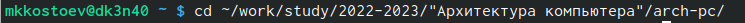

---
## Front matter
title: "Лабораторная работа №3"
subtitle: "Архитектура вычислительных систем"
author: "Мовсар Казбекович Костоев"

## Generic otions
lang: ru-RU
toc-title: "Содержание"

## Bibliography
bibliography: bib/cite.bib
csl: pandoc/csl/gost-r-7-0-5-2008-numeric.csl

## Pdf output format
toc: true # Table of contents
toc-depth: 2
lof: true # List of figures
lot: true # List of tables
fontsize: 12pt
linestretch: 1.5
papersize: a4
documentclass: scrreprt
## I18n polyglossia
polyglossia-lang:
  name: russian
  options:
	- spelling=modern
	- babelshorthands=true
polyglossia-otherlangs:
  name: english
## I18n babel
babel-lang: russian
babel-otherlangs: english
## Fonts
mainfont: PT Serif
romanfont: PT Serif
sansfont: PT Sans
monofont: PT Mono
mainfontoptions: Ligatures=TeX
romanfontoptions: Ligatures=TeX
sansfontoptions: Ligatures=TeX,Scale=MatchLowercase
monofontoptions: Scale=MatchLowercase,Scale=0.9
## Biblatex
biblatex: true
biblio-style: "gost-numeric"
biblatexoptions:
  - parentracker=true
  - backend=biber
  - hyperref=auto
  - language=auto
  - autolang=other*
  - citestyle=gost-numeric
## Pandoc-crossref LaTeX customization
figureTitle: "Рис."
tableTitle: "Таблица"
listingTitle: "Листинг"
lofTitle: "Список иллюстраций"
lotTitle: "Список таблиц"
lolTitle: "Листинги"
## Misc options
indent: true
header-includes:
  - \usepackage{indentfirst}
  - \usepackage{float} # keep figures where there are in the text
  - \floatplacement{figure}{H} # keep figures where there are in the text
---

# Цель работы

Целью работы является освоение процедуры оформления отчета с помощью легковесного языка разметки Markdown.

# Задание

# Выполнение лабораторной работы

1. Открыли терминал

{#fig:001 width=95%}
 
2. Переходим в каталог курса сформированный при выполнении лабораторной работы №2:

{#fig:002 width=95%}

Обновим локальный репозиторий, скачав изменения из удаленного репозитория с помощью каманды git pull

{#fig:003 width=95%}

3. Перейдем в каталог с шаблоном отчета по лабораторной работе №3

{#fig:004 width=95%}

4. Проведем компиляцию шаблона с использованием Makefile. Для этого введем команду make 

{#fig:005 width=95%}

При успешной компиляции должны сгенерироваться файлы report.pdf и report.docx.

{#fig:006 width-95%}

5. Удаляем полученный файл с использованием Makefile. Для этого введем команду make clean

{#fig:007 width=95%}

Проверяем, что после этой команды файлы report.pdf и report.docx были удалены 

{#fig:008 width=95%}

6. Откроем файл report.md с помощью любого тестого редактора 

{#fig:009 width=95%}

# Самостоятельная работа 

1. В соответсвующем каталоге сделаем отчёт по лабораторной работе №3 в формате Markdown. 

{#fig:010 width=95%}

2. Загрузим файлы на github.

{#fig:011 width=95%}
 
# Выводы

Я освоил процедуры оформления отчетов с помощью легковсного языка разметки Markdown

